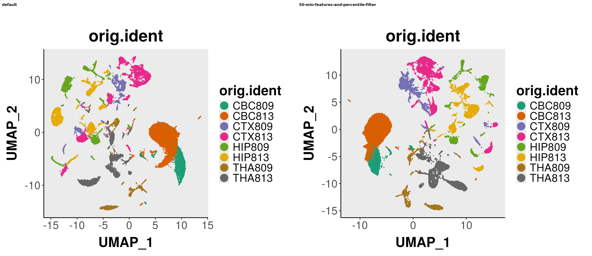
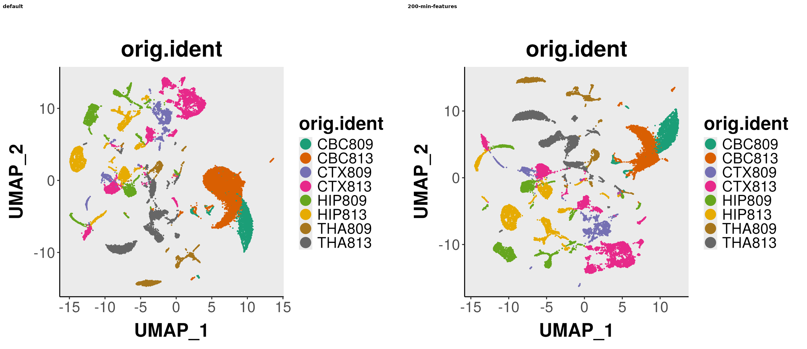
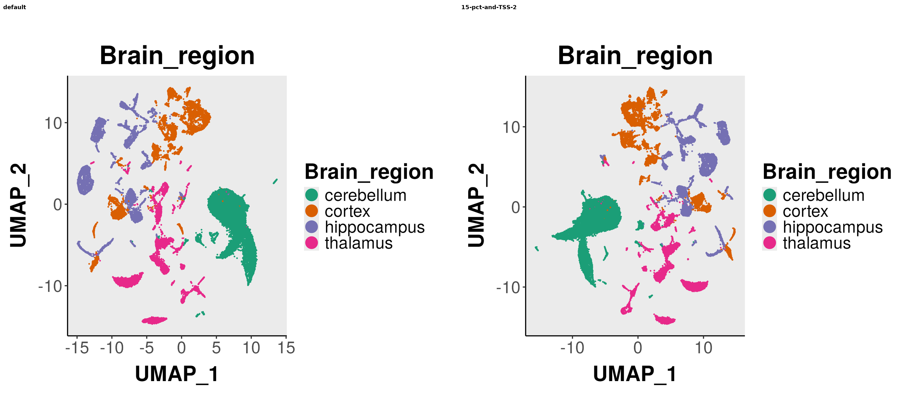

# Upstream QC Parameter Benchmark (Validation)

**Date:** 2026-08-28  
**Pipeline:** sc-epigenie `./analyses/upstream-analysis`  
**Cohort:** Internal mm10 scATAC-seq validation (8 samples; CBC809, CBC813, CTX809, CTX813, HIP809, HIP813, THA809, THA813)

**Analysts:** Sharon Freshour, PhD; Antonia Chroni

**Wiki summary (user-facing):** [Upstream QC Parameters](../wiki/Upstream-QC-Parameters.md) — paste into [GitHub wiki](https://github.com/stjude-dnb-binfcore/sc-epigenie/wiki/Upstream-QC-Parameters) when publishing.

---

## Purpose

This document records validation of upstream QC parameters in `project_parameters.Config.yaml`. Ten parameter configurations were tested on the same Cell Ranger input. Conclusions support default settings and document when analysts should deviate.

---

## Recommended defaults

| Parameter | Value | Rationale |
|-----------|-------|-----------|
| `min.features_value_module` | `50` | Sufficient for good-quality samples; use `200` only for suspect samples |
| `use_threshold_filtering_upstream` | `"YES"` | Better per-cell QC than percentile filtering |
| `pct_reads_in_peaks_value_upstream` | `20` | Lowering to 15 retains only ~5 additional cells |
| `TSS.enrichment_value_upstream` | `4` | Lower values mostly rescue low-quality cells |
| `blacklist_ratio_value_upstream` | `0.05` | Standard Signac threshold |
| `nucleosome_signal_value_upstream` | `3` | Standard Signac threshold |
| `min.cutoff_value_upstream` | `"q0"` | Use all peaks by default; try `q75` if integration UMAP is noisy |

---

## Benchmark results summary

| Project | Filter mode | Final cells | Median nFeature | Median TSS |
|---------|-------------|------------:|----------------:|-----------:|
| default | threshold | 38,058 | 3,317 | 6.48 |
| 50-min-percentile | percentile | 49,039 | 2,714 | 5.95 |
| 200-min-features | threshold | 30,200 | 4,854 | 6.37 |
| 15-pct-and-TSS-2 | threshold | 42,827 | 2,964 | 6.19 |

Full tables: internal benchmark folder `benchmarking-sc-atac-seq/comparison/results/tables/benchmark_comparison_summary.tsv`.

---

## Key findings

1. **Threshold vs percentile filtering** is the largest cell-count trade-off (~11k cells). Percentile filtering is too lenient as a default, especially for low-quality samples.

2. **`min.features = 200`** primarily affects low-quality samples. For good samples, the difference vs `50` is fewer than ~50 cells per sample.

3. **`min.cutoff_value_upstream` (q5, q75, q95)** does not change cell counts when percentile cell filtering is used. It affects FindTopFeatures peak selection and therefore DR/clustering. Sharon's evaluation suggests **q75** may produce cleaner integration UMAPs; **q95** is too stringent.

4. **Outlier samples dominate benchmarks.** One sample (`CBC813`) drove most sensitivity to `min.features`, TSS relaxation, and percentile filtering. See [Impact of excluding outlier samples](#impact-of-excluding-outlier-samples).

5. **Parameters with negligible effect:** `% reads in peaks` 15 vs 20; `min.cutoff` q5/q75/q95 on cell counts.

---

## Visual comparisons

Post-filter upstream UMAPs from the benchmark cohort.

### Threshold vs percentile filtering

Left: default (threshold filtering). Right: percentile filtering with `min.features = 50`.



### min.features 50 vs 200

Left: default (`min.features = 50`). Right: `min.features = 200` (threshold filtering).



### Default vs relaxed TSS (brain region)

Left: default (`TSS.enrichment = 4`). Right: relaxed TSS (`TSS.enrichment = 2`, `% reads in peaks = 15`), colored by brain region.



Additional side-by-side plots (internal): `benchmarking-sc-atac-seq/comparison/plots/umap_comparisons/`.

---

## Impact of excluding outlier samples

When the lowest-quality sample (`CBC813`) was excluded from analysis:

| Comparison | Delta (8 samples) | Delta (7 samples) |
|------------|------------------:|------------------:|
| 50-min vs 200-min features | +7,858 | **+127** |
| TSS=2 vs TSS=3 | +1,071 | **+113** |
| Percentile vs default | +10,981 | +5,379 |

**Implication:** Default recommendations hold for uniform good-quality cohorts. Parameter tuning matters most when individual samples fail Cell Ranger or Signac QC.

---

## Pipeline issues identified during validation

Document these when maintaining the pipeline:

| Issue | Location | Action |
|-------|----------|--------|
| FindClusters fails >46k cells | `integrative-analysis/util/function-samples-integrate.R` | Add `method = "igraph"` to `FindClusters()` |
| `min.cutoff_value_upstream` dual use | upstream + `cluster-cell-calling/util/export-cluster-peaks.R` | Consider separate YAML variables for cell vs plot cutoffs |

---

## Internal benchmark artifacts

St Jude internal path:

```
benchmarking-sc-atac-seq/comparison/
    README.md
    reports/
      01_benchmark_summary.md
      02_sharon_evaluation.md
      03_outlier_impact.md
    results/tables/
    plots/umap_comparisons/
```

---

## How to rerun after parameter changes

1. Edit `project_parameters.Config.yaml` (upstream section).
2. Rerun at minimum:
   - `./analyses/upstream-analysis`
   - `./analyses/integrative-analysis`
3. Review `analyses/upstream-analysis/plots/04_Final_summary_report/` before proceeding downstream.

---

## References

- [Upstream QC Parameters wiki draft](../wiki/Upstream-QC-Parameters.md)
- [Signac FindTopFeatures](https://stuartlab.org/signac/reference/findtopfeatures)
- [Seurat FindClusters igraph issue](https://github.com/satijalab/seurat/issues/7340)

---

*These tools and pipelines have been developed by the Bioinformatic core team at the [St. Jude Children's Research Hospital](https://www.stjude.org/). These are open access materials distributed under the terms of the [BSD 2-Clause License](https://opensource.org/license/bsd-2-clause), which permits unrestricted use, distribution, and reproduction in any medium, provided the original author and source are credited.*
